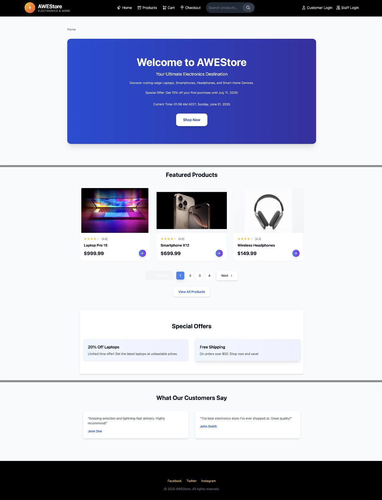
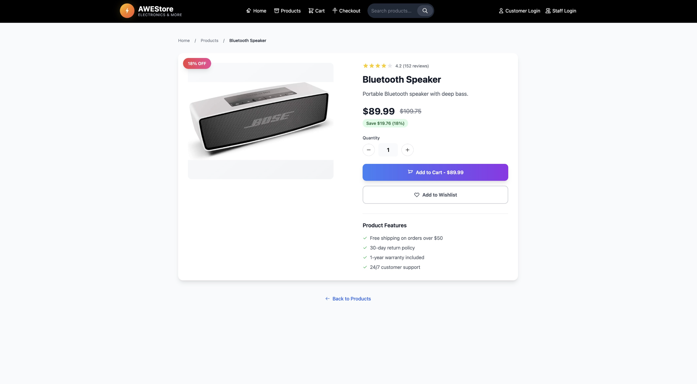
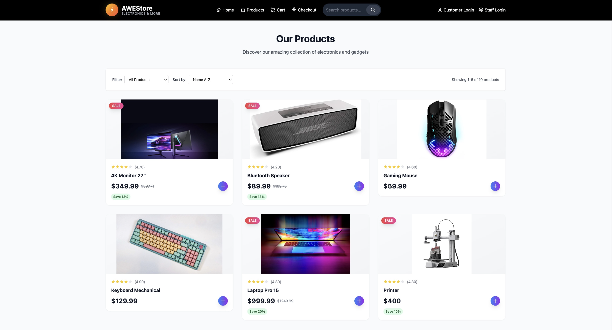
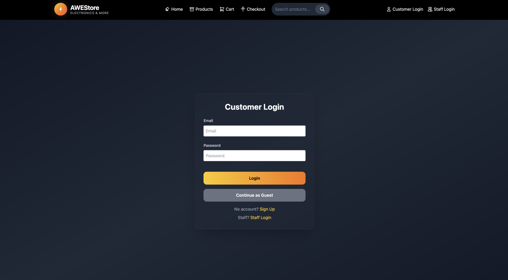
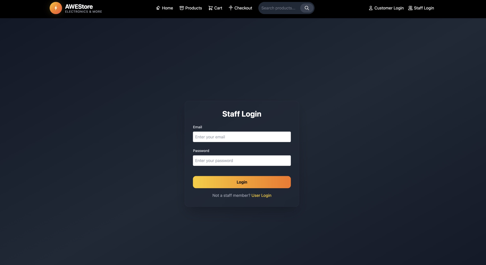
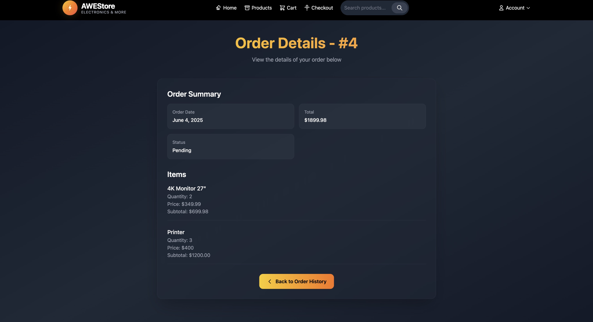

---
# 🛒 AWEStore – Electronics E-Commerce Platform

AWEStore is a modern, full-stack e-commerce platform built using **React** (frontend) and **Flask** (backend) for a seamless electronics shopping experience. It features a responsive UI, product catalog with real-time search, user authentication (for customers and staff), and order management powered by a RESTful API.
---

## ✨ Features

- **🔍 Product Search**: Real-time product search with instant results.
- **🖥️ Product Catalog**: Browse items like _Laptop Pro 15_, _Smartphone X12_, _4K Monitor 27”_ with prices, discounts, and ratings.
- **👁️ Quick View**: Preview product details in a modal without leaving the catalog.
- **🧭 Navigation**: Easy access to Home, Products, Cart, Checkout, and Account pages.
- **🔐 User Authentication**: Login and sign-up for both customers and staff.
- **📦 Order Management**: View customer orders and statuses (e.g., _Order #4 for Aarush Singh_).
- **💸 Special Offers**: Dynamic promotions like _20% off laptops_ or _free shipping on orders over \$50_.
- **📱 Responsive Design**: Built with Tailwind CSS for mobile and desktop compatibility.

---

## 🧠 Backend Overview – Flask API

The backend is developed using **Flask**, serving secure and scalable API endpoints.

### 🔑 Key Backend Features:

- **RESTful APIs**:

  - `api/searchProducts`
  - `api/loginCustomer`
  - `api/loginStaff`
  - `api/getOrder/:id`

- **Database**: Manages users, products, and orders using **SQLite** or **PostgreSQL**.
- **Authentication**: Secure login system for both customer and staff.
- **Integration**: Communicates with the frontend via **Axios**.

### 🔧 Setup (Backend)

```bash
cd backend
pip install -r requirements.txt
python main.py
```

Ensure your Flask API runs at `http://localhost:5000`.

---

## 💻 Frontend Overview – React App

Built using **React** with modern styling via **Tailwind CSS** for a clean and intuitive user interface.

### 🔧 Setup (Frontend)

```bash
git clone https://github.com/Aarush700/awe-online-electronics-store.git
cd frontend
npm install
npm start
```

Open `http://localhost:3000` to view the app.

---

## 📸 Screenshots

| Page                  | Description                                                       |
| --------------------- | ----------------------------------------------------------------- |
| **Homepage**          | Welcome banner, navigation, and 15% first-purchase offer          |
| **Featured Products** | Showcase: _Laptop Pro 15_ – \$999.99, _Smartphone X12_ – \$699.99 |
| **Product Catalog**   | List with filters, discounts (e.g., _4K Monitor_ – 12% off)       |
| **Customer Login**    | Login interface with email and password                           |
| **Staff Login**       | Separate staff authentication page                                |
| **Order Details**     | View order info for logged-in users (e.g., _Order #4_)            |

| Page                  | Screenshot                                              |
| --------------------- | ------------------------------------------------------- |
| **Homepage**          |                  |
| **Featured Products** |  |
| **Product Catalog**   |  |
| **Customer Login**    |      |
| **Staff Login**       |        |
| **Order Details**     |        |

---

## 🛠 Technologies Used

### Frontend

- **React** – Component-based UI framework
- **React Router** – Page navigation
- **Tailwind CSS** – Utility-first responsive design
- **Axios** – For HTTP API calls
- **Babel** – JavaScript and JSX transpilation

### Backend

- **Flask** – Lightweight Python web framework
- **Python** – Backend logic and API services
- **MySQL** – Database for products, users, and orders
- **Flask-CORS**, **dotenv**, etc. – Environment and request management

---

## 🚀 Future Enhancements

- [ ] Persistent Cart with backend storage
- [ ] Product filters (category, price, ratings)
- [ ] Payment gateway integration (Stripe/PayPal)
- [ ] ARIA accessibility improvements
- [ ] Frontend testing (Jest + RTL) & backend testing (Pytest)

---

## 📬 Contact

Have feedback or want to contribute?
**Email:** [aarush.singh@live.com](mailto:aarush.singh@live.com)
**LinkedIn:** [www.linkedin.com/in/aarush-singh-994010258](https://www.linkedin.com/in/aarush-singh-994010258)
